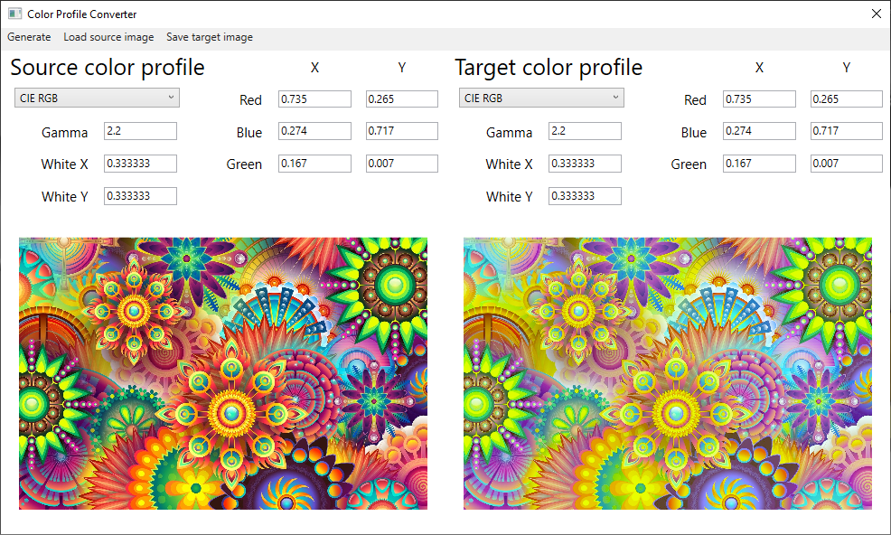

# Color Profile Converter

This is simple WPF application written in C# for a third year university subject Computer Graphics. It allows to convert color profile of pictures. It has a couple of predefined color profiles like sRGB or AdobeRGB, but it allows to tweak gamut triangle coordinates to achieve interesting colors in converted picture.
